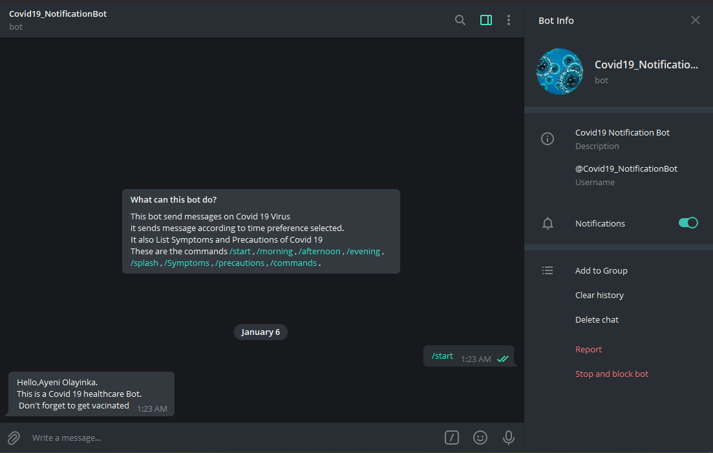

# Covid19_MessageBot - A Telegram Bot.

> Ruby Capstone Project (Covid19_MessageBot - A Telegram Bot)
Ruby Capstone Project is simple Bot that gives health TIps and Messagess against Covid 19. 

Covid19_MessageBot is a telegram bot where users can get health tips on Covid 19 virus. Users can get messages of how to prevent selfs from this virus. Also with a valid statistics.

## Built With

- Ruby
- Telegram Api

* GitHub: [@YinkTech](https://github.com/YinkTech)
* Twitter: [@YinkTech](https://twitter.com/YinkTech)
* LinkedIn: [Ayeni Olayinka](https://www.linkedin.com/in/ayeni-olayinka-726181134/)

## 🤝 Contributing

Contributions, issues, and feature requests are welcome!

## Show your support

Give a ⭐️ if you like this project!