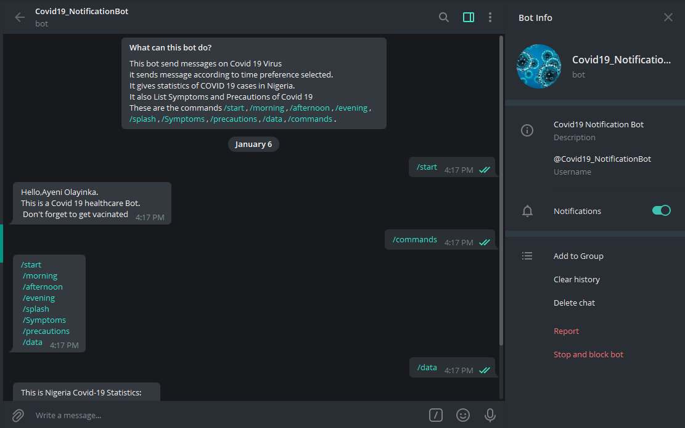

# Covid19_MessageBot - A Telegram Bot.

> Ruby Capstone Project (Covid19_MessageBot - A Telegram Bot)
Ruby Capstone Project is simple Bot that gives health TIps and Messagess against Covid 19. 

Covid19_MessageBot is a telegram bot where users can get health tips on Covid 19 virus. Users can get messages of how to prevent selfs from this virus.

## Built With

- Ruby
- Telegram Api

## How Covid19_MessageBot works

- Launch the Telegram app
- Search for @Covid19_MessageBot
- Click start to get started
- Run `/commands` to get the list of commands

## Getting Started

To get a local copy up and running follow these simple example steps.

### Prerequisites

- Web browser (e.g. Google Chrome or Firefox)
- Code Editor (e.g. Vscode or Atom)
- Telegram app

### Setup

- Copy this link [Telegram-Covid19_MessageBot](https://github.com/YinkTech/Telegram-Covid19_MessageBot)
- Open your terminal or command line in the folder you want the project to be
- Run the command git clone with the link you copied above `git clone https://github.com/YinkTech/Telegram-Covid19_MessageBot`
- Once you have a local copy, run `bundle install` to install all gemfiles in the directory
- Talk to @BotFather on Telegram to create your bot
- Get your token from the BotFather
- Add your token in bot.rb
- Insert the following line inside the bot.rb file: token = 'Paste the token you got from the BotFather here'
- Run bin/main.rb to get your bot up and running

## Built with:
- Ruby
- Telegram Api

## Author

* GitHub: [@YinkTech](https://github.com/YinkTech)
* Twitter: [@YinkTech](https://twitter.com/YinkTech)
* LinkedIn: [Ayeni Olayinka](https://www.linkedin.com/in/ayeni-olayinka-726181134/)

## 🤝 Contributing

Contributions, issues, and feature requests are welcome!

## Show your support

Give a ⭐️ if you like this project!